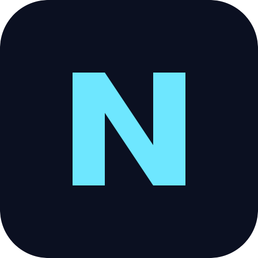
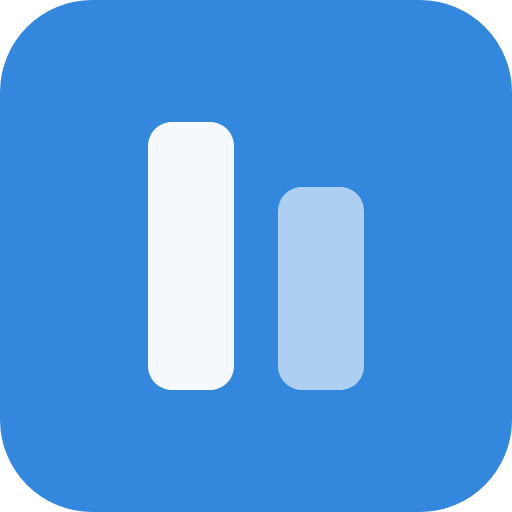
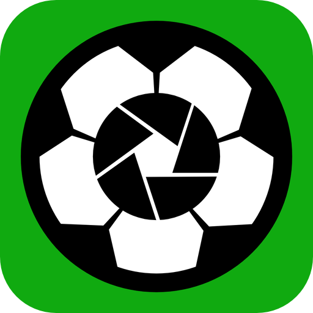

# Jett Nguyen
## Computer Science Major & Public Relations Minor Student @ University of Florida 2026 🐊 ⌨️ | Prev SWE Intern @ MARA

  
  

    
     
    
    
  

  
  
  

  
  

### About Me 📝

  

    <strong>Quick Facts:</strong>
    <ul>
      <li>📍 Gainesville, FL / Saint Petersburg, FL</li>
      <li>💻 CS Major (Herbert Wertheim College of Engineering)</li>
      <li>📢 PR Minor (College of Journalism and Communications)</li>
      <li>🎹 Music Producer (Rap, R&B, Electronic, Indie, & more)</li>
      <li>🛍️ eCommerce Seller (Vintage Clothing & Collectibles)</li>
    </ul>
  

  

    <em>I build thoughtful, user-centered interfaces that blend clean engineering with aesthetic-conscious visuals. My background in PR and music gives me a strong eye for storytelling, while coursework and internships have sharpened my frontend engineering skills. I lead projects end-to-end: map user journeys, prototype layouts, and ship accessible software that emphasizes accessibility and UX.</em>
  

### Skills 🛠️
 

 
  <strong>Languages</strong> 
  
  
  
  
  
  
  
  
    
 
  <strong>Frontend & Frameworks</strong> 
  
  
  
  
  
  
  
  
  
  
  
  
    
 
  <strong>Design & UX</strong> 
  
  
  
  
  
  
  
  
  
  
  
  
  
    
 
  <strong>Infrastructure & Tooling</strong> 
  
  
  
  
  
  
  
  
  
  
  
  
  
  
  
  
  
  
  
  
  
    
 
  <strong>Miscellaneous</strong> 
  
  
  
  
  
  
  
  
  
  
  
  
  
  
  
  

 

### Recent Projects ⏳

<table border="0" cellpadding="10" cellspacing="0" width="100%">
<tr>
<td width="25%" align="center" valign="top">
<strong><a href="https://nightlink.dev">  NightLink</a></strong>
 
<small>A web social media app that allows users to share their dreams with others and get analysis from AI</small>
</td>
<td width="25%" align="center" valign="top">
<strong><a href="https://studioflow-music.vercel.app/"> Studioflow</a></strong>
 
<small>A React web app for creatives to manage music, assets, lyrics, and social media content</small>
</td>
<td width="25%" align="center" valign="top">
<strong><a href="https://jettnguyen.github.io/Sideline/"> Sideline</a></strong>
 
<small>A mobile-first web application for easy youth soccer club video management and sharing</small>
</td>
<td width="25%" align="center" valign="top">
<strong><a href="https://jettnguyen.github.io/Stackd"> Stackd</a></strong>
 
<small>A mobile-first web appmade for UF students to create, store, study, and share flashcards</small>
</td>
</tr>
</table>

### Connect With Me 📲
💼 **[LinkedIn](https://www.linkedin.com/in/jett-nguyen/)**
📱 **[Instagram](https://www.instagram.com/7jettster7/)**
🔗 **[Jett2Fly.com](https://jett2fly.com/)**
